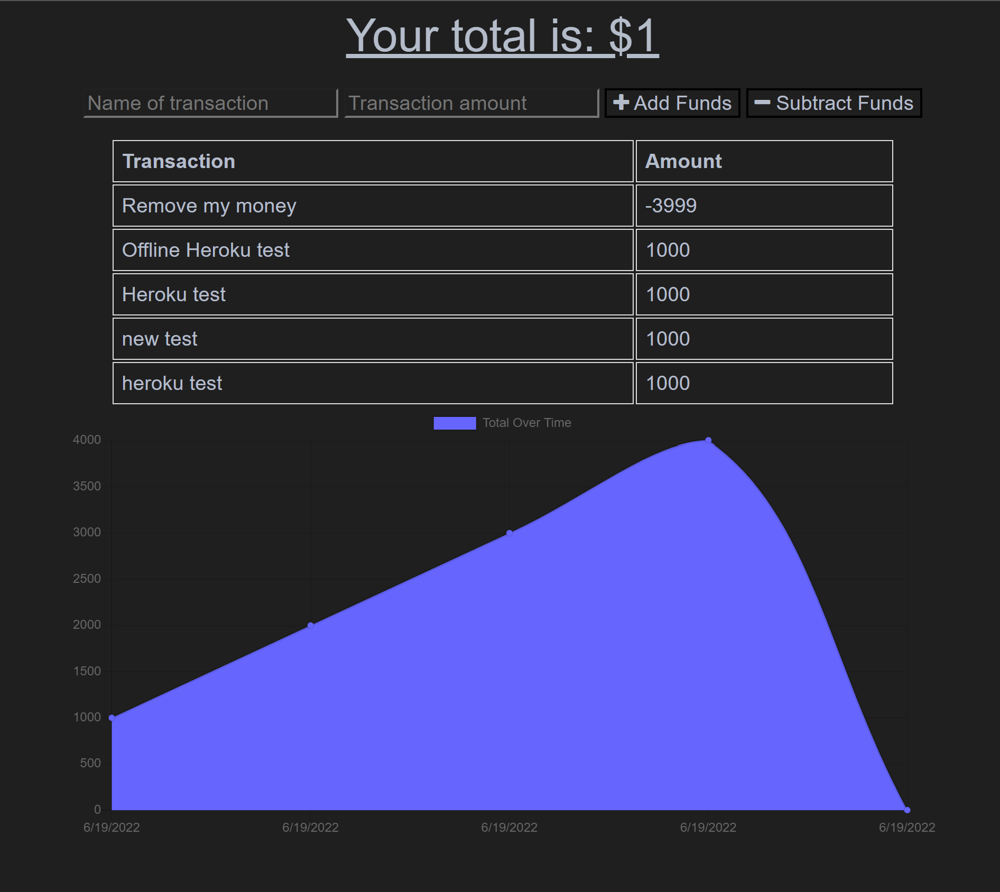

# Awesome Budget Tracker

## Description
A Progressive Web Application (PWA) Budget Tracker for tracking expenses and income.

## Table of Contents
* [Installation](#installation)
* [Usage](#usage)
* [Contributors](#contributors)
* [Tests](#tests)
* [Questions](#questions)
* [License](#license) 

## Installation
Execute npm install to install all the dependencies in package.json and create package-lock.json. Run the application locally by running 'npm start' or visit the application at its deployed location on Heroku (link below).

## Usage
Examples for use would be anyone who wants to keep track of expenses with an application that can function and keep track of expenses and income while in an offline state.

## Contributors
None

## Tests
Tested thoroughly with Chrome Dev tools to simulate offline conditions.

Contact information (email address & GitHub username) of the developer
## Questions
kevin.o.foreman2@gmail.com / kevin-foreman (GitHub)

## License
The license used for this project is MIT

URL of the deployed application: https://advanced-pwa-budget-tracking.herokuapp.com/

